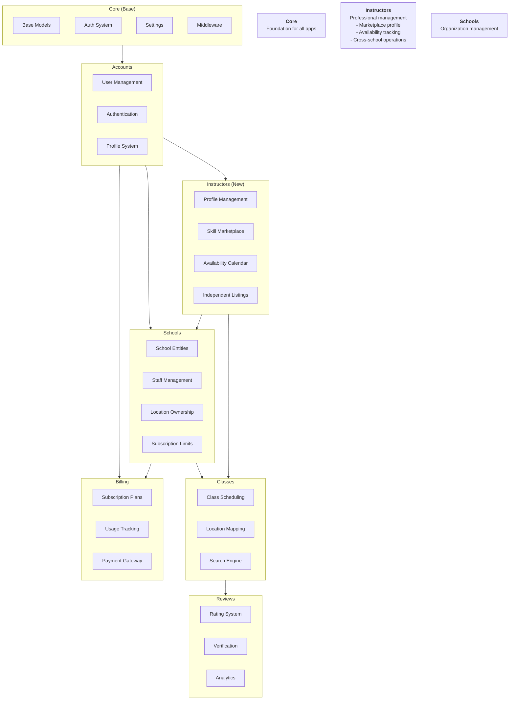
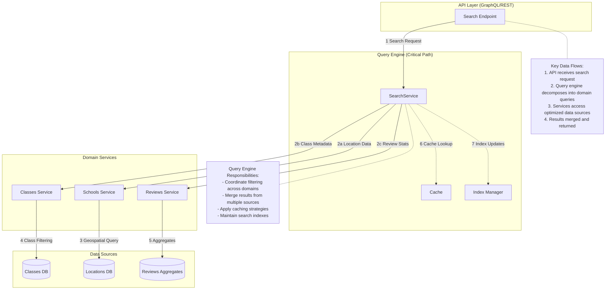

# General idea of architecture
## With added instructors

# General idea of search service 

Example Search for "Salsa Classes Near Me with AC and 4.5★ Ratings":
1. Schools Service finds locations within 5km with AC (using PostGIS)
2. Classes Service finds salsa classes at intermediate level
3. Reviews Service gets classes with avg rating ≥4.5
4. Query Engine joins these datasets using class-location mapping
5. Results sorted by distance and rating

